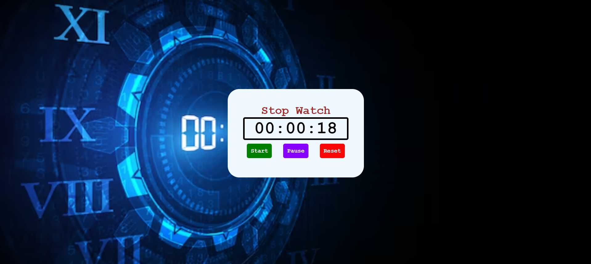

# Stopwatch

A simple stopwatch web application built using HTML, CSS, and JavaScript.

## Features

- Start: Start the stopwatch to begin timing.
- Pause: Pause the stopwatch to stop timing temporarily.
- Reset: Reset the stopwatch to zero.

## Screenshot

## Technologies Used

- HTML
- CSS
- JavaScript

